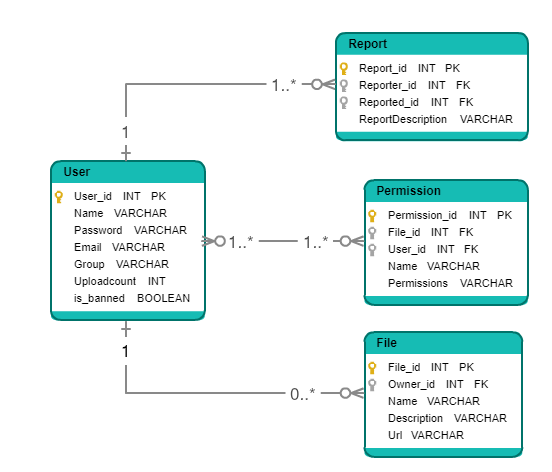

# Fájlmegosztó webes alkalmazás
## Az alkalmazás leírása
Fájlmegosztó webes alkalmazás, melyre fel lehet tölteni fájlokat, valamint le lehet tölteni azokat. A felhasználói élmény növelése érdekében lehetőség van fájlok keresésére különböző kritériumok szerint, fájlok rendszerezett feltöltésére mappákba való csoportosítással. A feltöltött fájlok nyilvánossága szabályozható jogosultságok beállításával, a szabálysértő fájlok, fájlleírások jelenthetőek, abejelentések elbírálását a moderátorok, adminisztrátorok végzik.
## Az alkalmazás funkciói
#### Felhasználói szintek
- Az alkalmazás bizonyos funkciói használhatóak regisztráció nélkül, több funkció használatához regisztráció szükséges (Username + Password + E-mail megadásával).
- Az alkalmazás lehetővé teszi "Admin" felhasználók létrehozását. Az adminoknak lehetőségük van felhasználók kitiltására, feltöltött fájlok törlésére, vagy annak adatainak módosítására (pl. név, jogosultságok).
- Az adminok létrehozhatnak jogosultsági szinteket, mint például moderátor, stb. és hozzájuk rendelheti a jogosultsági köröket (pl. törlés, jogosultságmódosítás, megtekintés, szerkesztés).
#### Fájlfeltöltés
- Fájlok feltöltésére a felhasználóknak van lehetőségük.
- A feltöltés során lehetőség van a feltöltött fájl(ok)hoz leírást írni.
- A feltöltés során lehetőség van mappákat létrehozni és ezekbe feltölteni.
- A feltöltendő fájlhoz lehetőség van jogosultságok beállítására.
- Lehetőség van fájlok keresésére, név, kiterjesztés, méret alapján.
#### Biztonság
- A szabálysértő fájlokat, fájlleírásokat lehet jelenteni.
- A jelentéshez szöveges magyarázatot is lehet fűzni.
- A jelentett fájlokat, leírásokat az adminok, moderátorok megtekinthetik és szabálysértés esetén törölhetik, valamint kitilthatják/korlátozhatják a szabálysértő felhasználót.
## Nem funkcionális követelmények

## Szerepkörök

## Az adatbázis struktúrája

