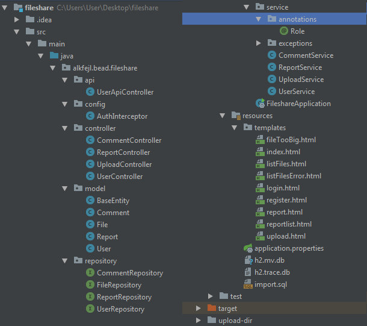

Szalai Norbert & Tóth Bálint

# Fájlmegosztó webes alkalmazás
## Az alkalmazás leírása
Fájlmegosztó webes alkalmazás, melyre fel lehet tölteni fájlokat, valamint le lehet tölteni azokat. A felhasználói élmény növelése érdekében lehetőség van a fájlok rendszerezett feltöltésére mappákba való csoportosítással. A szabálysértő felhasználók jelenthetőek, a bejelentések elbírálását a moderátorok, adminisztrátorok végzik.
## Az alkalmazás funkciói
#### Felhasználói szintek
- Az alkalmazás bizonyos funkciói használhatóak regisztráció nélkül, több funkció használatához regisztráció szükséges (Username + Password + E-mail megadásával).
- Az alkalmazás lehetővé teszi "Admin" felhasználók létrehozását. A moderátoroknak lehetőségük van felhasználók kitiltására, feltöltött fájlok, kommentek törlésére. Az adminoknak ezen felül lehetőségük van a felhasználók rangjának megváltoztatására, valamint kitiltásuk visszavonására is.
#### Fájlfeltöltés
- Fájlok feltöltésére a felhasználóknak van lehetőségük.
- A feltöltés során lehetőség van mappákat létrehozni és ezekbe feltölteni.
- A feltöltött fájlokat az adminok/moderátorok törölhetik.
#### Kommentek
- A felhasználóknak lehetőségük van a számukra letölthető fájlokat kommentelni.
- A fájlokhoz tartozó kommenteket lehetőség van elrejteni/megjeleníteni.
#### Biztonság
- A szabálysértő felhasználókat lehet jelenteni.
- A jelentéshez szöveges magyarázatot is lehet fűzni.
- A jelentett felhasználókat az adminok, moderátorok megtekinthetik és kitilthatják a szabálysértő felhasználót.
- Szabálysértés hiányában a jelentés törlésre kerül.
## Nem funkcionális követelmények
- Letisztult, felhasználóbarát kezelőfelület.
- Felhasználók adatainak, feltöltött tartalmainak biztonságos tárolása.
- Fájlfeltölés/letöltés gyors, hibamentes működése.
## Szerepkörök
- Adminisztrátor: Az alkalmazás legmagasabb rangú karbantartója. Jogosult a felhasználók rangjának módosítására, felhasználók kitiltására, fájlok törlésére.
- Moderátor: Az adminisztrátor nevezi ki. Az adminisztrátoréhoz hasonló jogkörrel bír, viszont a felhasználók rangját nem módosíthatja.
- Felhasználó: Jogosult fájlok feltöltésére, letöltésére, szabálysértő felhasználók jelentésére.
- Vendég: Csak fájlok letöltésére van jogosultsága.

# Backend

## Fejlesztői környezet, használt technológiák
Az alkalmazás backendje egy Maven projektként kerül megvalósításra a 2017.2.5-ös verziójú IntelliJ IDEA fejlesztőkörnyezet használatával.
A gyorsabb és hatékonyabb fejlesztés érdekében a következő függőségek (dependency) lettek használva a projektben:
- JPA
- DevTools
- Lombok
- Thymeleaf
- Web
- H2

A backend fejlesztése Java programozási nyelven történik a Java Spring keretrendszerben, a funkciók láthatóságát segítő sablonok HTML-ben lettek megvalósítva, az alkalmazás mögötti adatbázis a H2.

## Könyvtárstruktúra
A projekt könyvtárstruktúrája 5 fő részre bontható:
- Model: Az adatbázis táblái és mezői.
- Repository: Az adatbázis tábláinak lekérdező műveleteit tárolja.
- Service: Az adatbázis elemeihez létrehozott műveletek.
- Controller: A projekt végpontjait kezeli.
- Templates: A végpontokat bemutató HTML sablonok.

## Végpontok
User:
- GET user/
- GET user/logout
- POST user/login
- POST user/register
- POST user/control
- PATCH user/control/modify/:id
- PATCH user/control/ban/:id
- PATCH user/control/unban/:id

File/Upload:
- GET /listFiles/:path
- GET /showFile/:path/file
- GET /getFile/:path
- POST /listFiles/:path/upload
- POST /listFiles/:path/createDir
- DELETE /listFiles/:path

Report:
- GET /report/list
- POST /report
- DELETE /report/delete/:id
- DELETE /report/ban/:id

Comment:
- GET showFile/:path/comments
- POST showFile/:path/comment
- DELETE showFile/:path/comments/:id

A user/register végpont működésének ábrázolása szekvenciadiagrammal (vendégként, helyes adatokat megadva):

## Az adatbázis struktúrája

# Frontend
## Fejlesztői környezet, használt technológiák
Az alkalmazás frontendje egy Angular projektként kerül megvalósításra a 2017.2.5-ös verziójú JetBrains WebStorm fejlesztőkörnyezet használatával.
A backend projekt fejlesztése TypeScript nyelven történik a Node.js használatával, a projekt futtatását az Angular CLI biztosítja.

## Könyvtárstruktúra
A projekt forráskódja az Angular/fileshare/src/app könyvtárban található, mely az alábbiakból áll:
- app.component fájlok: Az egész alkalmazásra ható kinézeteket, sablonokat, eljárásokat tartalmazzák.
- app.module.ts: Az alkalmazások végpontjaihoz tartozó komponenseket deklarálja, valamint a projekthez használt modulokat tartalmazza.
- Könyvtárak:
  - classes: A projekt Model része, a backend adatbázisának tábláit tartalmazza TypeScript osztályok formájában.
  - components: A projekt végpontjainak megjelenítéséért felelő, a servicek használatával a backenddel kommunikáló, kontrollerként működő fájlokat tartalmazza, alkönyvtárai a végpontok, valamint a hozzájuk fűződő adatbázisbeli táblák, és azok listáinak komponensei.
  - services: A backenddel való kommunikációt valósítja meg, HTTP Requesteket tartalmazó TypeScript fájlok segítségével.
  - routing: A Router modul route-jait definiálva összeköti a projekt végpontjait a komponensekkel.

## Kliensoldali szolgáltatások
- Be- és kijelentkezés
- Elérhető fájlok listázása
- Adott fájlhoz tartozó aloldal elérése
- Fájl letöltése
- (FELHASZNÁLÓ) Az aloldalon való kommentelés lehetősége
- (FELHASZNÁLÓ) Saját komment törlése
- (FELHASZNÁLÓ) Fájlfeltöltés
- (FELHASZNÁLÓ) Felhasználó jelentése
- (MOD/ADMIN) Jelentéslista elérése
- (MOD/ADMIN) Jelentett felhasználó kitiltása
- (MOD/ADMIN) Jelentés törlése
- (ADMIN) Felhasználó kiltiltásának visszavonása
- (ADMIN) Felhasználó rangjának módosítása

## Felhasználói szerepkörök funkciói

## Tesztelés
A projekt frontendjének 3 végpontja került tesztelésre: /login, /register, /report
- Login:
  - /login végpont elérhetősége
  - Bejelentkezés megkísérlése hibás adatokkal
  - Bejelentkezés megkísérlése kitiltott felhasználóval
  - Bejelentkezés helyes adatokkal
  - Bejelentkezés után a /login végpont üres oldalt ad vissza
  - Bejelentkezés után a /register végpont üres oldalt ad vissza
- Register:
  - /register végpont elérhetősége
  - Regisztráció megkísérlése rövid felhasználónévvel
  - Regisztráció megkísérlése rövid jelszóval
  - Regisztráció megkísérlése helytelen e-maillel 1. teszt
  - Regisztráció megkísérlése helytelen e-maillel 2. teszt
  - Regisztráció megkísérlése helytelen e-maillel 3. teszt
  - Regisztráció megkísérlése helytelen felhasználónévvel (speciális karakter)
  - Regisztráció megkísérlése helytelen jelszóval (speciális karakter)
  - Regisztráció helyes adatokkal
  - Regisztráció megkísérlése már használatban lévő felhasználónévvel
  - Regisztráció megkísérlése már használatban lévő e-maillel
- Report:
  - Bejelentés megkísérlése nem létező felhasználónévvel
  - Bejelentés helyes adatokkal
